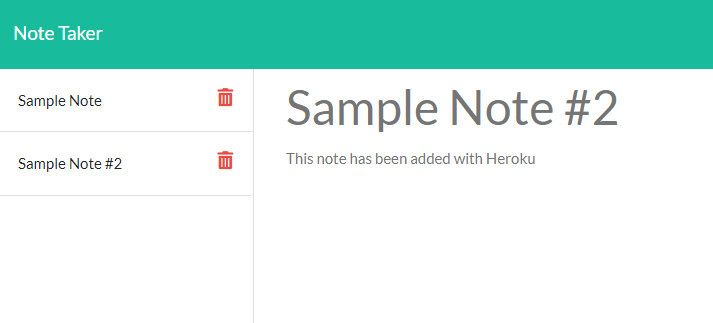

# Digital Scratchpad

## Purpose
Given a prebuilt website, I aimed to test my skills and tie it into a basic json stored database. Users should be able to take notes by giving them a title and some text, then click the save button. Users will also be able to delete any notes they no longer need.

## Built with

- short-unique-id 
    `npm install short-unique-id`
- express.js 
    `nmp install express`
- [Heroku](https://heroku.com)

## Links

[Live Site](https://powerful-harbor-85966.herokuapp.com/) 
[Check out the Repo](https://github.com/gatorhatur/notetaker-w-express)